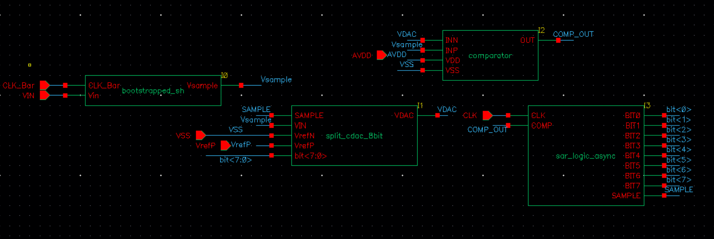
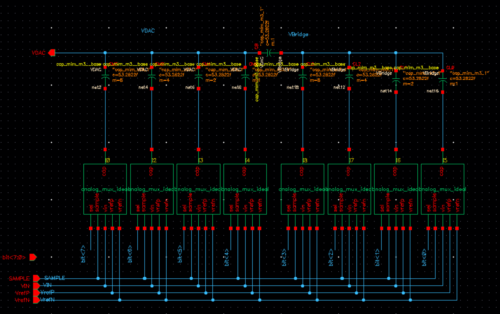
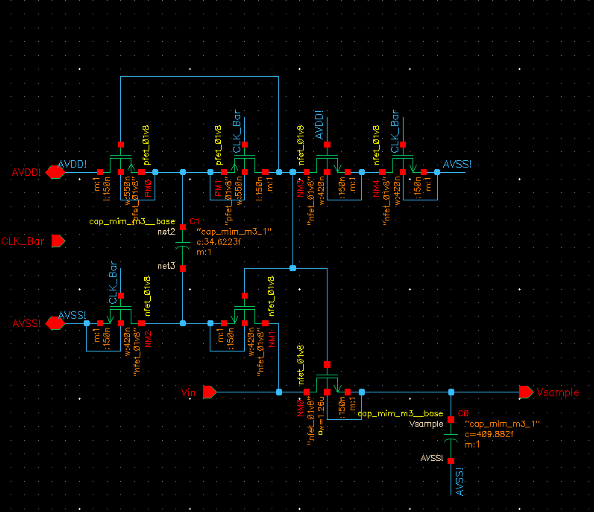
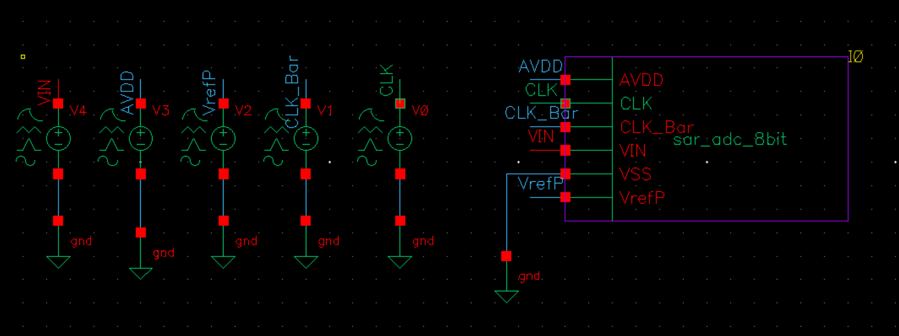
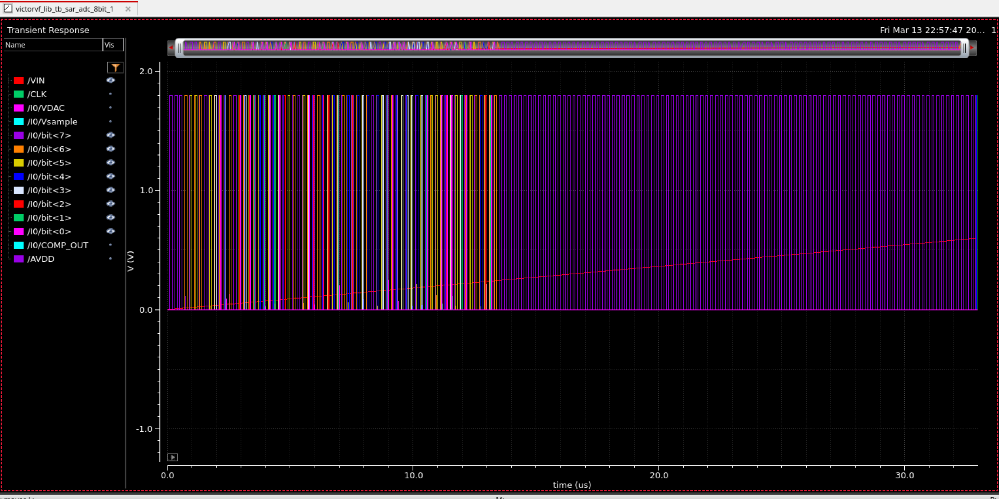
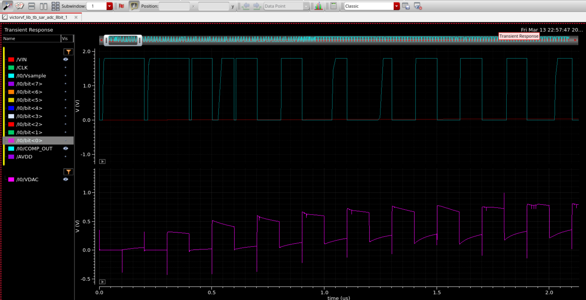
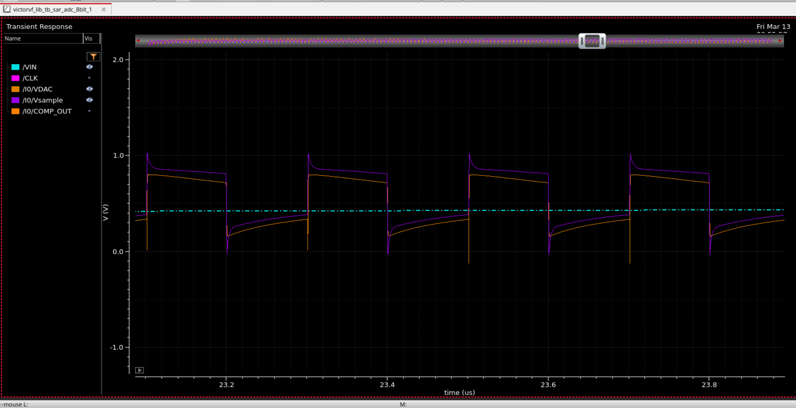
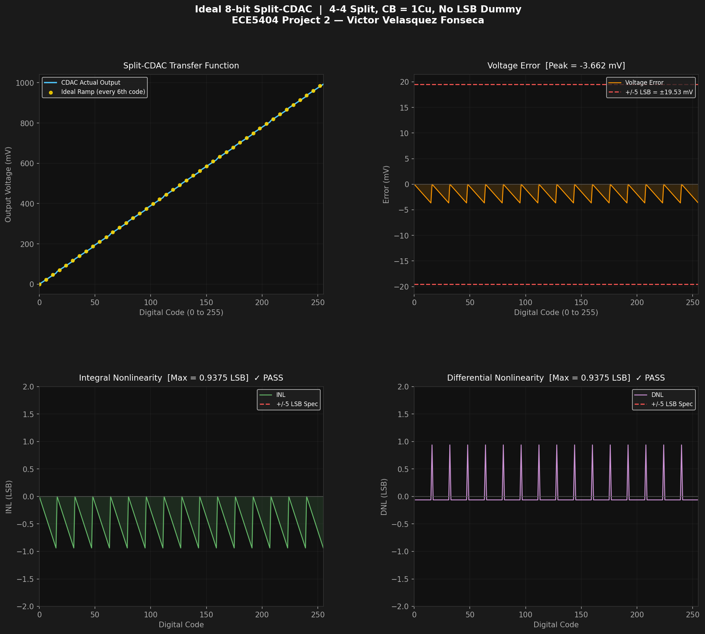

# ⚡ 8-bit Asynchronous Split-CDAC SAR ADC - SkyWater SKY130 PDK

**Course:** ECE5404 Advanced Analog IC Design | Virginia Tech, Spring 2026
**Author:** Victor Velasquez Fonseca

---

##  Overview

Full custom design and simulation of an **8-bit, 5 MS/s Successive Approximation Register (SAR) ADC** implemented in the open-source **SkyWater SKY130 130 nm PDK** using **Cadence Virtuoso** and **Spectre**.

The design utilizes a **4-4 Split Capacitive DAC (CDAC)** architecture to reduce total capacitance from 256 Cu (full binary-weighted) to **31 Cu across 9 MIM capacitors**, an 8x reduction, while achieving **Max |INL| = Max |DNL| = 0.9375 LSB**, well within the ±5 LSB specification.

The SAR controller was developed at two abstraction levels: a **Verilog-A behavioral model** for Cadence Spectre simulation, and a **synthesizable SystemVerilog FSM** targeting ASIC tape-out flows.

---

##  Specifications

| Parameter | Target / Value |
|-----------|---------------|
| Resolution | 8 bits |
| Sampling Rate | 5 MS/s |
| Conversion Time | 80 ns (8 bit-cycles × 10 ns/bit) |
| Reference Voltage | 1.0 V |
| Supply Voltage | 1.8 V |
| Max \|INL\| | 0.9375 LSB ✓ |
| Max \|DNL\| | 0.9375 LSB ✓ |
| Total Capacitance | 31 Cu = 1651.7 fF (9 MIM caps) |
| PDK | SkyWater SKY130 (open-source, 130 nm) |
| Tool | Cadence Virtuoso + Spectre |

---

##  Engineering Trade-offs & Key Design Decisions

### 1. Split-CDAC vs. Full Binary-Weighted Architecture
A full 8-bit binary-weighted CDAC requires 256 Cu, with the MSB capacitor alone requiring 128 Cu. The 4-4 split architecture caps the largest capacitor at 8 Cu, reducing total capacitance by 8x. This directly minimizes die area, reduces switching power ($P \propto C \cdot V^2 \cdot f$), and mitigates sensitivity to process-induced capacitor mismatch.

### 2. Integer-Only MIM Capacitor Constraint
The ideal bridge capacitor ($C_B$) for a 4-4 split is exactly 16/15 Cu (approximately 1.0667 Cu). However, the SKY130 `cap_mim_m3__base` cell only accepts integer multipliers. Rounding $C_B$ to 1 Cu introduces a deterministic, analytically predictable error: a -0.9375 LSB gain error and a single INL spike at the MSB/LSB code boundary. Since this predictable error remains within the ±5 LSB specification, this trade-off prioritizes manufacturability and layout matching over ideal linearity.

### 3. Asynchronous SAR Logic
A standard synchronous 8-bit SAR running at 5 MS/s requires an external bit-clock of 40-80 MHz. The asynchronous approach employs a self-timed comparator-valid strobe to advance bit decisions. This eliminates the requirement for a high-frequency global clock tree, thereby reducing digital switching power by an estimated 20-25%.

---

##  Architecture & 4-Block Hierarchy

```
VIN ──► [Bootstrapped S/H] ──Vsample──► [Split-CDAC] ──VDAC──► [Comparator] ──► [SAR Logic]
                                                                                       │
                                               bit<7:0> ◄─────────────────────────────┘
```

| Block | Cell Name | Description |
|-------|-----------|-------------|
| Bootstrapped S/H | `bootstrapped_sh` | Constant-Ron NMOS switch ($V_{GS} = V_{IN} + V_{DD}$). Eliminates signal-dependent sampling distortion. |
| Split-CDAC | `split_cdac_8bit` | 4-4 split charge-redistribution DAC. 9 MIM caps (M=8,4,2,1 each sub-array + bridge $C_B$). |
| Comparator | `comparator` | Dynamic latch comparator. Regenerates comparator output within 10 ns. |
| SAR Controller | `sar_logic_async` | Self-timed 8-bit successive approximation. No internal high-frequency clock required. |

---

##  Split-CDAC Capacitor Array

| Capacitor | Sub-Array | Weight | Multiplier (M) | Value (fF) |
|-----------|-----------|--------|----------------|-----------|
| CM3 (MSB) | MSB | 8 Cu | 8 | 426.3 |
| CM2 | MSB | 4 Cu | 4 | 213.1 |
| CM1 | MSB | 2 Cu | 2 | 106.6 |
| CM0 (dummy) | MSB | 1 Cu | 1 | 53.3 |
| CB (bridge) | Bridge | 1 Cu | 1 | 53.3 |
| CL3 | LSB | 8 Cu | 8 | 426.3 |
| CL2 | LSB | 4 Cu | 4 | 213.1 |
| CL1 | LSB | 2 Cu | 2 | 106.6 |
| CL0 | LSB | 1 Cu | 1 | 53.3 |
| **Total** | | **31 Cu** | | **1651.7 fF** |

---

##  Schematics (Cadence Virtuoso / SKY130)

### Top-Level SAR ADC


### Split-CDAC Sub-Block


### Bootstrapped Sample-and-Hold


### Testbench


---

##  Simulation Results (Cadence Spectre)

Full 55 µs transient simulation. VIN ramp from 0 V to 0.9375 V, sweeping all 256 output codes.

### Full 55 µs Transient — All 8 Bit Outputs


### Timing Diagram — COMP_OUT + VDAC Binary Search


### Zoomed 800 ns View — 4 Conversion Cycles


---

##  Ideal Python Model - INL / DNL

Prior to Cadence implementation, the complete transfer function was modeled in Python to verify INL and DNL. The model confirmed that with $C_B$ = 1 Cu, the design passes all linearity specifications.



**Run it yourself:**
```bash
pip install numpy matplotlib
cd python
python split_cdac_model.py
```

---

##  SAR Controller - SystemVerilog FSM

A synthesizable RTL implementation of the asynchronous SAR controller is provided alongside the Verilog-A simulation model. The FSM is parameterized by `N` (ADC resolution) and utilizes self-timed states (`IDLE → SAMPLE → CONV → DONE`) that advance on the `comp_valid` strobe.

```systemverilog
module sar_fsm #(parameter int unsigned N = 8) (
    input  logic         clk, rst_n, start,
    input  logic         comp_valid, comp_out,
    output logic         sample, eoc,
    output logic [N-1:0] bit_out, dout
);
```

---

##  Repository Structure

```
Split-CDAC-Asynchronous-SAR-ADC/
├── README.md
├── .gitignore
├── python/
│   └── split_cdac_model.py          ← Ideal behavioral model + INL/DNL
├── results/
│   └── split_cdac_results.png       ← 4-panel INL/DNL figure
├── cadence/
│   ├── veriloga/                    ← Behavioral models for Virtuoso ADE
│   │   ├── sar_logic_async.vams
│   │   └── comparator.vams
│   └── schematics/                  ← Exported Virtuoso schematics
├── rtl/
│   ├── sar_fsm.sv                   ← Synthesizable SystemVerilog FSM
│   └── sar_fsm_tb.sv                ← Digital testbench
└── simulations/                     ← Exported Spectre waveform plots
```

---

##  References

1. B. Razavi, *Design of Analog CMOS Integrated Circuits*, 2nd ed., McGraw-Hill Education.
2. Z. Xu, et al., "A 12-Bit 50 MS/s Split-CDAC-Based SAR ADC Integrating Input Programmable Gain Amplifier and Reference Voltage Buffer," *Electronics*, 2022.
3. Q. Zhang, et al., "A High Area-Efficiency 14-bit SAR ADC With Hybrid Capacitor DAC for Array Sensors," *IEEE Transactions on Circuits and Systems I: Regular Papers*, 2020.
4. M. Aldacher, *Analog Design of Asynchronous SAR ADC (45 nm CMOS)* — GitHub: [muhammadaldacher/Analog-Design-of-Asynchronous-SAR-ADC](https://github.com/muhammadaldacher/Analog-Design-of-Asynchronous-SAR-ADC)
5. SkyWater SKY130 PDK Documentation: [skywater-pdk.readthedocs.io](https://skywater-pdk.readthedocs.io)
6. Y. Yi, ECE5404 Advanced Analog IC Design, Virginia Tech, Spring 2026.

---

*ECE5404 Advanced Analog IC Design - Virginia Tech, Spring 2026*
